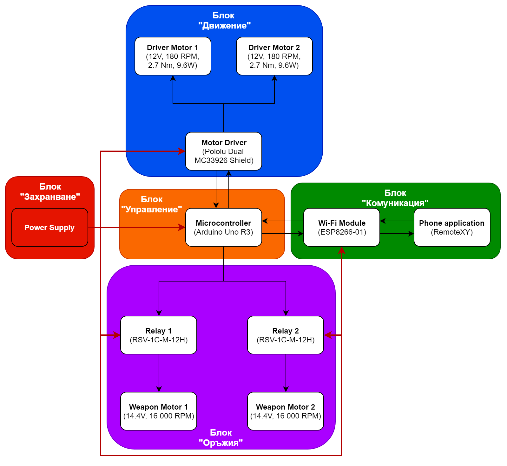
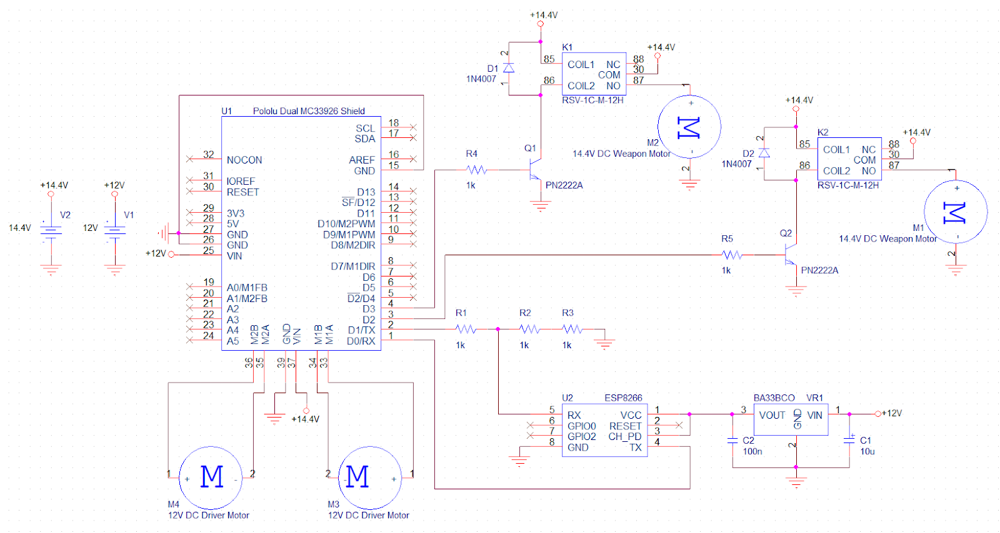
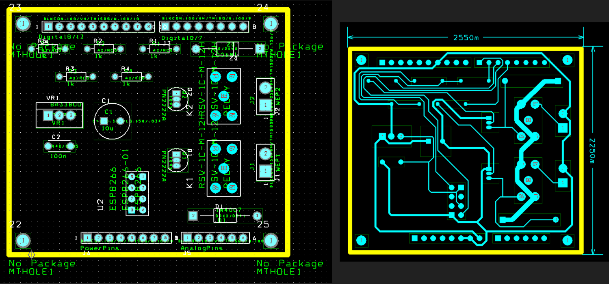

# Боен робот с дистанционно управление Remote control Battlebot

# [Официална документация](./Documents/Battlebot_Documentation_Iliyan_Antov.pdf)
# [Презентация на проекта](https://docs.google.com/presentation/d/1odBkF2noT_PoMxy1lFQc3AZkdeY1q7n4EqtyDL5grHw/edit?usp=sharing)

*Робот с дистанционно управление. Разработен за училищно състезание, вдъхновено от телевизионното шоу Battlebots. Разполага с мощни мотори и драйвери за задвижване, мотори за въртене на свредла (оръжията на робота), Wi-Fi модул за дистанционна комуникация и микроконтролер (Arduino) за управление*

## Блок схема:

## Електрическа схема:

## Печатна платка:

## Използвани технологии:

* [C/C++ (Arduino)](https://www.arduino.cc/reference/en)
* [Arduino Uno R3](https://www.arduino.cc/reference/en)
* [ESP8266](https://www.espressif.com/sites/default/files/documentation/esp8266-technical_reference_en.pdf)
* [Pololu Dual MC33926 Motor Shield](https://www.pololu.com/docs/0J55)

## Автор:

Илиян Антов - [Iliyan Antov](https://github.com/IliyanAntov) - [i.antov2@gmail.com](i.antov2@gmail.com)
